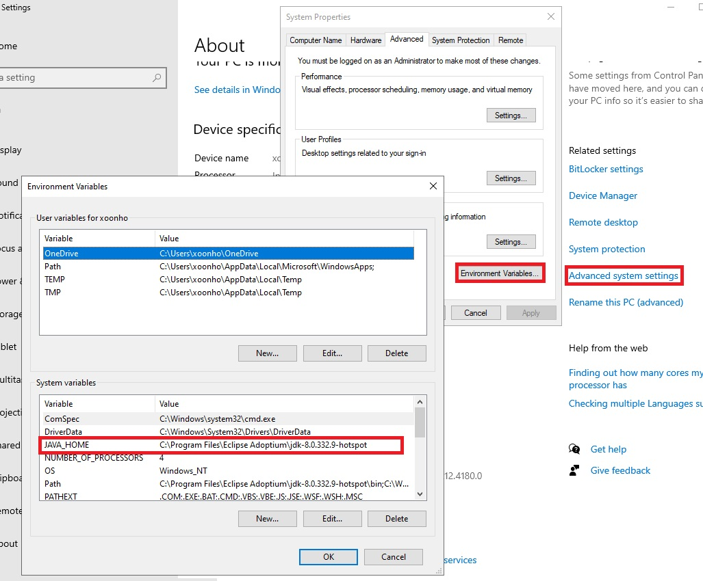
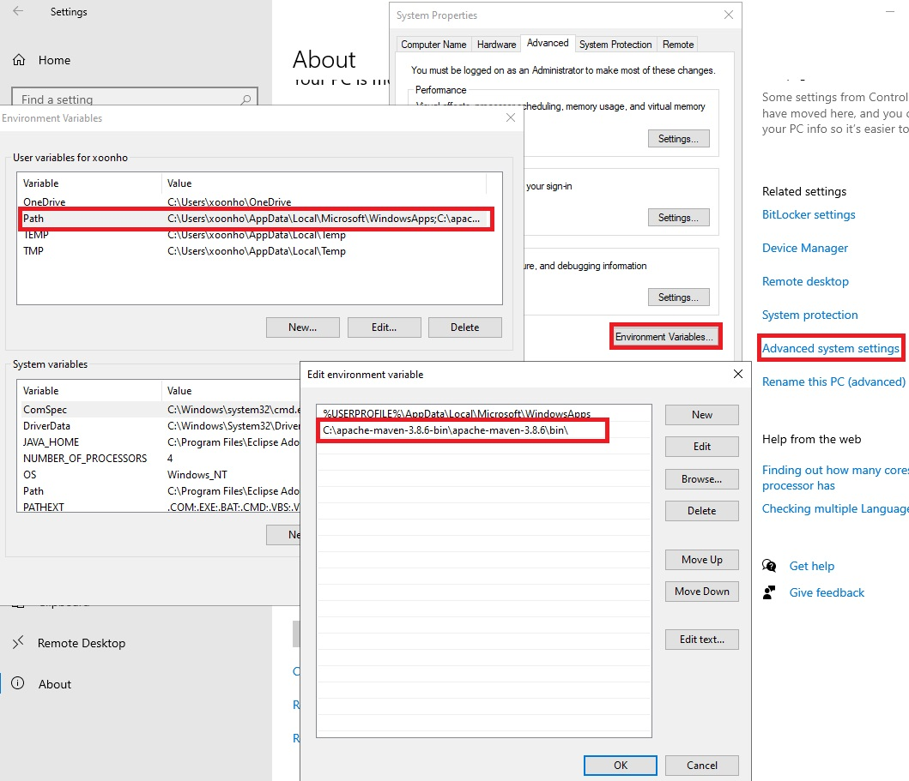

# CosmosDB-HandsOn-Workshop

## Java Labs

### 1. 사전요구 사항
이 실습을 시작하기 전에 로컬 컴퓨터에 다음 운영 체제와 소프트웨어가 구성되어 있어야 합니다.   
<br></br>
### 2. 운영체제
    - 64-bit Windows 10 Operating System
    - 최신 보안 업데이트 적용
<br></br>
### 3. 소프트웨어
|Software|Download Link|
|---|---|
|Git|[/git-scm.com/downloads](https://git-scm.com/downloads)|
|Visual Studio Code|[/code.visualstudio.com/download](https://go.microsoft.com/fwlink/?Linkid=852157)|
|Java Extension Pack|[/vscode-java-pack](https://marketplace.visualstudio.com/items?itemName=vscjava.vscode-java-pack)|
|Maven|[/maven.apache.org/](https://maven.apache.org/)|
|Java 8 JDK(or greater)|[/jdk8-downloads](https://cdn.azul.com/zulu/bin/zulu8.64.0.15-ca-jdk8.0.342-win_x64.msi)|   
   
* Visual Studio Code 환경설정   
    * Java Home 설정   
</img><br/>       
    * Maven 윈도우 Path 추가   
</img><br/>   
    * Visual Studio Maven, JAVA 경로 설정   
Visual Studio 메뉴에서 File->Preferences->settings 클릭
</img><br/>   
오른쪽 상단의 Open settings(JSON) 클릭   
</img><br/>   
열린 Editor에 아래 내용 추가
```
        {"maven.executable.path": "C:\\apache-maven-3.8.6-bin\\apache-maven-3.8.6\\bin\\mvn",
         "java.configuration.runtimes": [{"name": "JavaSE-1.8",
                                          "path": "C:\\Program Files\\Zulu\\zulu-8"}]
        }
```
<!--
####    - Test java sample download
```
    git clone https://github.com/Azure-Samples/azure-cosmos-java-getting-started.git
```
####    - Code Test 
```
    cd azure-cosmos-java-getting-started
    mvn clean package
```
-->
<br></br>
### 4. 파워쉘 모듈 설치   
Azure 파워쉘 모듈이 설치되지 않은 경우 설치 해야 함   
```powershell
Set-ExecutionPolicy -ExecutionPolicy RemoteSigned -Scope CurrentUser

Install-Module -Name Az -Scope CurrentUser -Repository PSGallery -Force
```   
* Link: https://docs.microsoft.com/en-us/powershell/azure/install-az-ps   
<br></br>
### 5. Workshop Github 소스 다운로드
####    - Example Github SDK resource download   
```
    git clone https://github.com/Azure/azure-sdk-for-java
```   
####    - Example Github Workshop resource download   
```
    git clone https://github.com/AzureCosmosDB/labs.git
```   
<br></br>
### 6. Use case
- [Use-Case cheat sheet (1-pager)](https://azurecosmosdb.github.io/labs/decks/1Pager-Use-Cases.pptx) 
<br></br>
### 7. Workshop list
1. [Java SDK V4](https://docs.microsoft.com/ko-kr/azure/cosmos-db/sql/sql-api-sdk-java-v4)   
2. [Java SDK_FAQ](https://docs.microsoft.com/ko-kr/azure/cosmos-db/sql/sql-api-sdk-java-v4#faq)   
3. [Java Workshop Schedule](https://azurecosmosdb.github.io/CosmosDBWorkshops/#schedule)   
<br></br>
<!--
### 8. Workshop deck
1. [Overview, Value Proposition & Use Cases](https://azurecosmosdb.github.io/labs/decks/Overview-Value-Proposition-Use-Cases.pptx)  1day   
2. [Resource Model](https://azurecosmosdb.github.io/labs/decks/Resource-Model.pptx)  1day   
3. [Request Units & Billing](https://azurecosmosdb.github.io/labs/decks/Request-Units-Billing.pptx)  1day   
4. [Data Modeling](https://azurecosmosdb.github.io/labs/decks/Data-Modeling.pptx)  1day   
5. [Prtitioning](https://azurecosmosdb.github.io/labs/decks/Partitioning.pptx)  1day   
6. [SQL API Query](https://azurecosmosdb.github.io/labs/decks/SQL-API-Query.pptx)   
7. [Server Side Programming](https://azurecosmosdb.github.io/labs/decks/Server-Side-Programming.pptx)   
8. [Troubleshooting](https://azurecosmosdb.github.io/labs/decks/Troubleshooting.pptx)   
9. [Concurrency](https://azurecosmosdb.github.io/labs/decks/Concurrency.pptx)   
10. [Change Feed](https://azurecosmosdb.github.io/labs/decks/Change-Feed.pptx)   
11. [Global Distribution](https://azurecosmosdb.github.io/labs/decks/Global-Distribution.pptx)   
12. [Security](https://azurecosmosdb.github.io/labs/decks/Security.pptx)
<br></br>
-->
### 8. Java Lab Guides
1. [Pre-lab: Lab 환경 배포](https://github.com/Eivissa/CosmosDB-HandsOn-Workshop/blob/main/HandsonLabs/PreLab_%ED%99%98%EA%B2%BD_%EA%B5%AC%EC%84%B1.md#pre-lab-lab-%ED%99%98%EA%B2%BD-%EB%B0%B0%ED%8F%AC)  
2. [Creating a container in Azure Cosmos DB](https://github.com/Eivissa/CosmosDB-HandsOn-Workshop/blob/main/HandsonLabs/Lab01.md#creating-a-container-in-azure-cosmos-db)   
3. [Importing Data into Azure Cosmos DB with Azure Data Factory](https://github.com/Eivissa/CosmosDB-HandsOn-Workshop/blob/main/HandsonLabs/Lab02.md#importing-data-into-azure-cosmos-db-with-azure-data-factory)   
4. [Building a Java Console App on Azure Cosmos DB](https://github.com/Eivissa/CosmosDB-HandsOn-Workshop/blob/main/HandsonLabs/Lab05.md#building-a-java-console-app-on-azure-cosmos-db)   
5. [Intro to Azure Cosmos DB Change Feed](https://github.com/Eivissa/CosmosDB-HandsOn-Workshop/blob/main/HandsonLabs/Lab08.md#intro-to-azure-cosmos-db-change-feed)   
6. [Troubleshooting Performance in Azure Cosmos DB](https://github.com/Eivissa/CosmosDB-HandsOn-Workshop/blob/main/HandsonLabs/Lab09.md#troubleshooting-performance-in-azure-cosmos-db)   

<!--[Lab 1: Creating a container in Azure Cosmos DB]   
[Lab 2: Importing Data into Azure Cosmos DB with Azure Data Factory]   
[Lab 3: Querying in Azure Cosmos DB]   
[Lab 4: Indexing in Azure Cosmos DB]   
[Lab 5: Building a Java Console App on Azure Cosmos DB]   
[Lab 6: Multi-Document Transactions in Azure Cosmos DB]   
[Lab 7: Transactional Continuation in Azure Cosmos DB]   
[Lab 8: Intro to Azure Cosmos DB Change Feed]   
[Lab 9: Troubleshooting Performance in Azure Cosmos DB]   
[Lab 10: Optimistic Concurrency Control in Azure Cosmos DB]   
[Post-lab: Cleaning Up]   
-->
<br></br>
### 9. Benchmark tool
[Benchmark tool test](https://github.com/Azure/azure-sdk-for-java/tree/main/sdk/cosmos/azure-cosmos-benchmark)   
[Performance tips](https://docs.microsoft.com/ko-kr/azure/cosmos-db/sql/performance-tips-java-sdk-v4-sql)   
[Troubleshooting](https://docs.microsoft.com/ko-kr/azure/cosmos-db/sql/troubleshoot-java-sdk-v4-sql)   
